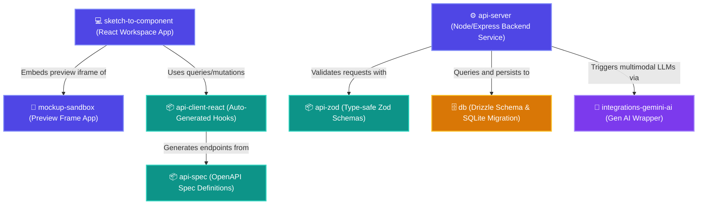
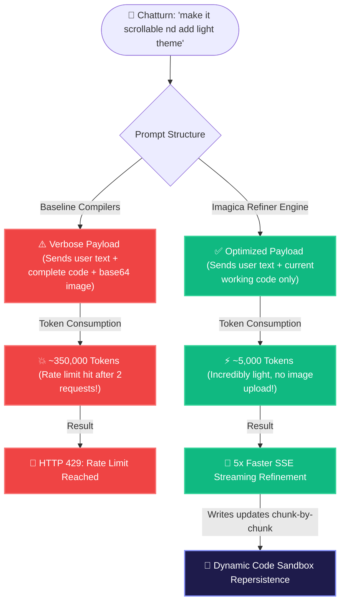

<p align="center">
  
</p>

<h1 align="center">Imagica</h1>

<p align="center">
  <strong>AI Sketch-to-Component Workbench (Enterprise Edition)</strong>
</p>

<p align="center">
  🌐 <a href="https://imagicasite.xyz" target="_blank">imagicasite.xyz</a>
</p>

---
Imagica is an elite, industrial-grade, AI-powered developer workbench that transforms hand-drawn sketches, structural wireframes, and UI screenshots into high-performance, responsive, production-ready web components. Inspired by the sleek, minimalist labs theme of Google AI Studio, Imagica integrates state-of-the-art vision models, secure authentication, live sandbox preview frames, and an optimized, token-efficient refinement chatbot.

---

## 🏗️ System & Core Architecture Deep-Dive

Imagica is architected as a high-performance **pnpm monorepo workspace**. The entire ecosystem is divided into three distinct layers:
1. **Frontend Layer**: The developer workbench interface and sandbox preview frame.
2. **Backend Services Layer**: The Express API gate, database schema engines, and SSE stream handlers.
3. **Shared Monorepo Libraries**: Reusable packages for Zod schemas, DB connections, API client generators, and Gemini SDK integrations.

---

## 📊 Visual System Flows & Architecture Diagrams

### 1. Workspace Dependency & Monorepo Topology
This diagram illustrates the monorepo structure and how individual applications depend on shared type-safe library workspace layers:



---

### 2. Multi-Model Robust Code Generation Pipeline
Here is the step-by-step pipeline when a user uploads a hand-drawn sketch. Notice the recursive **Gemini Fallback Models Loop** and **Exponential Backoff Retry Gate** that ensure zero downtime:

```mermaid
sequenceDiagram
    autonumber
    actor User as 👤 Developer / Designer
    participant UI as 💻 Front-End App (React)
    participant Server as ⚙️ Express Backend (api-server)
    participant Auth as 🔐 Clerk Authentication
    participant Gemini as 🧠 Google Gemini Vision API
    participant DB as 🗄️ Database (Drizzle SQLite)

    User->>UI: Upload hand-drawn UI sketch & select framework
    UI->>Auth: Validate user session token
    Auth-->>UI: Session token valid
    UI->>Server: POST /api/sketches (base64 image, framework, styling instructions)
    Note over Server: Server reads x-gemini-api-key header<br/>Falls back to environment keys if empty.

    rect rgb(30, 27, 75)
        Note over Server: [Model Fallback Loop & Retry Gate]
        Server->>Gemini: Attempt 1: gemini-2.0-flash (Upload base64 image + layout prompt)
        alt Case A: 429 Rate Limit / Quota Exhausted on Flash 2.0
            Gemini-->>Server: Error 429 (Resource Exhausted)
            Server->>Server: catch 429 -> Try next candidate model
            Server->>Gemini: Attempt 2: gemini-2.5-flash (Execute stream compilation)
        else Case B: Transient 503 / Network Timeout
            Gemini-->>Server: Error 503 (Service Overloaded)
            Server->>Server: withRetry helper waits 2s -> 4s -> 8s (Exponential Backoff)
            Server->>Gemini: Retry Attempt
        end
    end

    Gemini-->>Server: 200 OK: Complete React/HTML structured markup stream
    Server->>DB: Save Sketch details (generatedCode, framework, layout analysis JSON)
    DB-->>Server: Record created successfully
    Server-->>UI: HTTP 201 Created: Hydrated sketch state
    UI->>User: Launch code inside Developer Workbench (Interactive Live Sandbox)
```



---

### 3. Token-Optimized Refiner Chatbot Architecture (Refine Turn)
Unlike baseline sketch tools that upload giant base64 image payloads (~300,000+ tokens) on every single chat turns, Imagica implements a **95%+ token-saving strategy** that completely bypasses free-tier TPM (Tokens Per Minute) quotas:



---

## 🛠️ Complete Monorepo Technology Stack

| Target Layer | Framework / Module | Highlights & Visual Customizations |
|---|---|---|
| **Frontend Platform** | React 19, TypeScript | Strict type safety, high-performance visual states, responsive dashboard grid |
| **Monorepo Router** | `wouter` | Blazing-fast router matching wildcards, trailing slashes normalizing, lightweight routing |
| **Authentication** | `@clerk/clerk-react` | Secure authentication locking down private workspace routes, fully integrated layout buttons |
| **API Backend** | Node.js, Express, Pino | Lightweight JSON API server, structured Pino logger streaming generation events |
| **Database Engine** | Drizzle ORM, SQLite | Fast SQLite database, type-safe queries, migration catalogs |
| **Visual Styling** | Tailwind CSS v4, Lucide | Spacey dark theme, HSL customized color palettes, seamless video loop landing page |
| **Export Sandbox** | StackBlitz Custom SDK | One-click export playgrounds assembling components instantly in live browser Sandboxes |

---

## 📁 Repository Directory Structure

```
├── artifacts/
│   ├── api-server/              # Express API Server (ports, DB controllers, Gemini routers, fallback loops)
│   │   ├── src/
│   │   │   ├── routes/          # Express route definitions (sketches stats, messages, refinement streams)
│   │   │   ├── lib/             # Drizzle SQLite database configurations and Drizzle client connectors
│   │   │   └── index.ts         # Server entry point
│   ├── mockup-sandbox/          # Iframe Sandboxing server compiling user components for preview
│   └── sketch-to-component/     # Front-end workbench dashboard React client
│       ├── src/
│       │   ├── components/      # UI components (Header layout, settings modal, system statistics)
│       │   ├── pages/           # Pages (Landing page, Convert workbench, sketch details, preview tabs)
│       │   └── index.css        # Core custom-themed CSS and custom animation transitions
├── lib/
│   ├── api-client-react/        # Auto-generated Tanstack Queries hooks querying the server
│   ├── api-spec/                # Monorepo OpenAPI contracts and Orval configurations
│   ├── api-zod/                 # Shared data validation Zod schemas (CreateSketch, Regenerate)
│   ├── db/                      # Shared SQLite migrations and schema tables (Conversations, Messages, Sketches)
│   └── integrations-gemini-ai/  # Shared Google Gen AI SDK client and resolution logic
├── package.json                 # Monorepo workspace configuration
└── pnpm-workspace.yaml          # Monorepo dependencies definitions
```

---

## ⚙️ Environment Configuration

To configure local or production instances, create separate `.env` files in their respective folders:

### 1. Frontend Configuration
Create `artifacts/sketch-to-component/.env`:
```env
# Clerk Publishable Key (from clerk.com dashboard)
VITE_CLERK_PUBLISHABLE_KEY=pk_test_...
```

### 2. Backend Configuration
Create `artifacts/api-server/.env`:
```env
# Clerk Secret Key (from clerk.com dashboard)
CLERK_SECRET_KEY=sk_test_...
```

> [!TIP]
> You can also set `GEMINI_API_KEY` inside `artifacts/api-server/.env` to configure a default fallback key on the server side so your users don't need to configure one.

---

## 🚀 Unified Execution Commands (Run and Build)

Imagica utilizes **pnpm workspace filters** to manage all packages from the root workspace directory. You **never** need to manually `cd` into individual folders.

### 📦 1. Installation
Install all monorepo dependencies, link local library packages, and compile workspace structures:
```bash
pnpm install
```

### 💻 2. Running in Development Mode
To start all servers (Frontend React App, Sandbox Preview Frame, and Backend Express API) concurrently in local development mode:
```bash
pnpm run dev
```
* **Frontend workbench Application**: `http://localhost:25383`
* **Sandbox Preview Application**: `http://localhost:25384`
* **API Backend Server**: `http://localhost:18080`

### 🏗️ 3. Compiling for Production
To typecheck the entire monorepo and generate compiled production bundles:
```bash
pnpm run build
```

### ⚙️ 4. Run Production Server
To start the compiled production Express server (which automatically serves the compiled frontend assets statically):
```bash
pnpm start
```

### 🚨 5. Typechecking & Linting
To perform isolated TypeScript compiler checks across all frontend libraries and backend services:
```bash
pnpm run typecheck
```

---

## 🔬 Isolated Sub-Project Operations
If you want to run commands inside specific sub-folders, you can use the `--filter` flag from the root directory:

* **Backend DB migrations generation**:
  ```bash
  pnpm --filter @workspace/db run generate
  ```
* **Backend DB migrations execution**:
  ```bash
  pnpm --filter @workspace/db run push
  ```
* **Regenerate frontend API client hooks from OpenAPI spec**:
  ```bash
  pnpm --filter @workspace/api-spec run generate
  ```

---
*Built with passion and 🔮 Google Gemini AI.*
